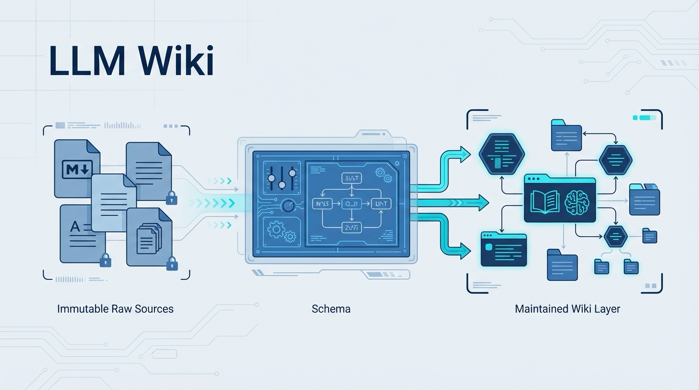

# Karpathy LLM Wiki Bootstrap

[简体中文](./README.zh-CN.md)

An installable skill and a working reference implementation for building persistent, LLM-maintained Markdown wikis.



The most important thing here is not just the bootstrap skill, but **the worked example**. Starting from [karpathy-llm-wiki-original.md](./karpathy-llm-wiki-original.md), the LLM incrementally compiles source material into [llm-wiki/](./llm-wiki)—growing an [index](./llm-wiki/wiki/index.md), a [log](./llm-wiki/wiki/log.md), concept pages, comparison pages, and synthesis pages. The point is not a one-off summary, but a **maintainable knowledge artifact**.

That same pattern works for articles, papers, research reports, and books:

- keep raw evidence in `raw/`
- keep evolving understanding in `wiki/`
- use **ingest**, **query**, and **lint** to keep the structure alive over time

> **Full walkthrough →** [Reading Is Not Enough: How to Compile an Article into an LLM Wiki](./from-article-to-llm-wiki.article.en.md)  ·  [中文版](./from-article-to-llm-wiki.article.zh-CN.md)

## What This Repo Contains

This repository has two closely related parts:

- [skill/](./skill) is the installable skill package. Use it to bootstrap your own wiki.
- [llm-wiki/](./llm-wiki) is a real example wiki created with that skill and then maintained through the ingest, query, and lint loop.

That split is intentional: `skill/` is the reusable product, while `llm-wiki/` shows the pattern in practice.

## Quick Install

Recommended:

```bash
npx skills add nanzhipro/Karpathy-llm-wiki-bootstrap-skill@llm-wiki-bootstrap
```

Non-interactive user-level install:

```bash
npx skills add nanzhipro/Karpathy-llm-wiki-bootstrap-skill@llm-wiki-bootstrap -g -y
```

## First Run Example

Here is the simplest first-time workflow, using [karpathy-llm-wiki-original.md](./karpathy-llm-wiki-original.md) as the seed source.

This example assumes you are using OpenAI Codex, so the generated schema file will be `AGENTS.md`. If you choose Claude Code instead, use `CLAUDE.md` in the same step.

1. In your agent, trigger the skill:

   > `bootstrap a wiki`

2. When the skill asks its setup questions, choose values like these:

   - Domain: `Research topic`
   - Wiki name: `llm-wiki-demo`
   - Agent: `OpenAI Codex`
   - Editor: `Obsidian`
   - Source types: `Web articles`
   - Output location: `Current directory`

3. After the wiki scaffold is created, copy the seed source into the new raw folder:

   ```bash
   cp karpathy-llm-wiki-original.md llm-wiki-demo/raw/
   ```

4. Then tell the agent:

   > `Read llm-wiki-demo/AGENTS.md, then ingest llm-wiki-demo/raw/karpathy-llm-wiki-original.md`

5. After the first ingest, inspect these files:

   - `llm-wiki-demo/wiki/index.md`
   - `llm-wiki-demo/wiki/log.md`
   - `llm-wiki-demo/wiki/overview.md`

What you should expect after that first run:

- a source summary page under `wiki/sources/`
- new concept or entity pages if the agent identifies them
- an updated index, log, and overview

If you want to see what a completed run looks like before trying it yourself, open [llm-wiki/](./llm-wiki).

Tip for a Chinese-language wiki:

If you want the wiki to be compiled in Chinese from the start, you can simply tell the agent:

> `使用中文编译 karpathy-llm-wiki-original.md`

## Why This Pattern Exists

Most LLM document workflows stop at RAG: upload files, retrieve a few chunks at question time, and synthesize an answer from scratch. That works—but it does not build lasting structure.

This project packages a different model:

- Raw sources stay **immutable**
- The agent incrementally **compiles** knowledge into a wiki
- The wiki becomes a **persistent artifact** that grows over time
- Useful answers get filed back into the wiki instead of disappearing into chat history

**The result:** a knowledge base that compounds instead of resetting on every query.

## System Model

The full system has four layers:

| Layer | Location | Role |
| --- | --- | --- |
| Skill package | `skill/` | Bootstrap logic, templates, and workflow rules |
| Raw sources | `raw/` | Immutable evidence layer |
| Schema | `AGENTS.md` / `CLAUDE.md` / `SCHEMA.md` | Operating contract for the agent |
| Wiki pages | `wiki/` | Maintained knowledge layer |

The skill creates the bottom three layers inside a new wiki.

The example in `llm-wiki/` shows what that looks like after the system has already been used.

## The Reference Wiki

[llm-wiki/](./llm-wiki) is not placeholder content. It is a working example generated from the skill and then maintained as a living wiki.

Current structure:

```text
llm-wiki/
├── AGENTS.md
├── raw/
│   ├── Karpathy x.md
│   └── llm-wiki-pattern.md
└── wiki/
    ├── index.md
    ├── log.md
    ├── overview.md
    ├── concepts/
    ├── entities/
    ├── comparisons/
    ├── sources/
    └── synthesis/
```

Useful entry points:

- [llm-wiki/AGENTS.md](./llm-wiki/AGENTS.md) for the generated agent instructions
- [llm-wiki/wiki/index.md](./llm-wiki/wiki/index.md) for the catalog the agent navigates through
- [llm-wiki/wiki/log.md](./llm-wiki/wiki/log.md) for the chronological operation history
- [llm-wiki/wiki/overview.md](./llm-wiki/wiki/overview.md) for the current top-level synthesis

If you want to understand the pattern quickly, `llm-wiki/` is the best place to inspect it in action.

## Origin And Source Lineage

The underlying idea comes from Karpathy's original LLM Wiki note:

- Original gist: <https://gist.github.com/karpathy/442a6bf555914893e9891c11519de94f>
- Repository copy: [karpathy-llm-wiki-original.md](./karpathy-llm-wiki-original.md)

The example wiki is grounded in that note. Source lineage in this repo:

| Source | Role |
| --- | --- |
| [karpathy-llm-wiki-original.md](./karpathy-llm-wiki-original.md) | Reference copy of the original idea |
| [llm-wiki/raw/llm-wiki-pattern.md](./llm-wiki/raw/llm-wiki-pattern.md) | Example-local raw source derived from it |
| [llm-wiki/raw/Karpathy x.md](./llm-wiki/raw/Karpathy%20x.md) | Shows how additional sources get absorbed |

Clean framing for public-facing explanation:

1. The **skill** packages the method
2. The **example wiki** demonstrates the method in use
3. The **corpus** starts from Karpathy's idea, then grows through new sources

## Recommended Installation Layout

Use `.agent/skills/` as the canonical installation location.

If Claude, Codex, or another runtime expects a separate discovery directory, link that runtime back to the same installed copy instead of duplicating files.

```text
.agent/
└── skills/
    └── llm-wiki-bootstrap/
        ├── SKILL.md
        └── references/
```

Example symlinks:

```bash
ln -s /absolute/path/to/.agent/skills/llm-wiki-bootstrap ~/.claude/skills/llm-wiki-bootstrap
ln -s /absolute/path/to/.agent/skills/llm-wiki-bootstrap ~/.codex/skills/llm-wiki-bootstrap
```

> **Principle:** keep one real installed copy and point every runtime back to it.

---

## What The Skill Generates

When you bootstrap a new wiki, the generated structure looks like this:

```text
{wiki-name}/
├── raw/
├── wiki/
│   ├── index.md
│   ├── log.md
│   └── overview.md
├── {schema-file}
└── .gitignore
```

Schema filename by runtime:

| Agent | Schema File |
| --- | --- |
| Claude Code | `CLAUDE.md` |
| OpenAI Codex | `AGENTS.md` |
| Copilot (VS Code) | `.github/copilot-instructions.md` |
| Other / generic | `SCHEMA.md` |

Only the filename changes. The operating model stays the same.

---

## Core Operations

| Operation | Trigger | Result |
| --- | --- | --- |
| Ingest | `"ingest raw/{file}"` | Turns a source into summaries, entities, concepts, links, index updates, and a log entry |
| Query | Ask a domain question | Reads the index, opens relevant pages, and answers with citations |
| Lint | `"lint"` or `"health check"` | Audits contradictions, stale claims, orphan pages, and missing links |

## Repository Layout

| Path | Purpose |
| --- | --- |
| [skill/SKILL.md](./skill/SKILL.md) | Installable skill definition |
| [skill/references/templates](./skill/references/templates) | Templates used during bootstrap |
| [skill/references/workflows](./skill/references/workflows) | Detailed ingest, query, and lint workflow references |
| [karpathy-llm-wiki-original.md](./karpathy-llm-wiki-original.md) | Repository copy of the original idea note |
| [llm-wiki/AGENTS.md](./llm-wiki/AGENTS.md) | Generated agent instructions for the example wiki |
| [llm-wiki/raw](./llm-wiki/raw) | Example source corpus |
| [llm-wiki/wiki](./llm-wiki/wiki) | Example compiled wiki output |

## One-Line Positioning

`Karpathy LLM Wiki Bootstrap` is an installable skill for creating persistent, LLM-maintained Markdown wikis, bundled with a real `llm-wiki/` reference implementation grounded in Karpathy's original LLM Wiki idea.
